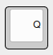
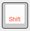
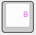
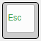

# Steve's macropad layout

When you don’t have many keys, you have to use some magic to get all the
functions you need. As this is a gaming macropad, we want WASD and the
surrounding keys, so the top 12 keys are what you would find on any QWERTY
keyboard.

The black labels on the keys are the usual function when you tap the key. For
all the keys except the Z key, it’s also what you get when you hold the key
down.

The red labels (well, there’s only one at the time of writing) are the function
when you hold the key.  So for this key, you get a “z” when you tap it, and
shift when you hold it (for running, etc).

The pink labels are what you get when you double tap a key. You need this extra
column of keys, at least Rage 2 does, so being able to single or double tap to
get different keys seems to work well. Just imagine that double tap gets you the
key that would be in the next column if the macropad was 5 columns wide. There
is a slight delay for a single key press to register. This is because when you
press a key once, the keyboard waits for about 200 milliseconds to see if you’re
going to press the key a second time. It’s just noticeable but hopefully it
doesn’t affect your game play.

The L1 key momentarily switches the layer. When you’re holding the L1 key, all
the other keys change function to do what the green labels say. When you release
the L1 key, the other keys all swap back to their default use.

## Changing the layout
It’s worth noting that this is a custom layout, it’s not some pre-made thing.
It was made with [Rage 2](https://bethesda.net/en/game/rage2) in mind but
hopefully it'll also work on other (non-FPS) games too. If any aspect of the
layout doesn't work, it can be changed.

## Features
- Bluetooth 4.2 and 5
- micro-USB wired connection
- rechargable lithium battery (LIR2032)
- on/off switch
- auto-sleep after 10 minutes

## Using the keyboard
The keyboard can operate in wired mode, using the micro-USB plug, or wirelessly
using Bluetooth. To use it wired, just plug it in, there's no need to turn it
off. To use it wirelessly, turn the power switch on.

## Pairing
TODO This knowledge might be wrong. I've figured it out by trial and error.

1. turn the macropad on. You'll see the red and blue LEDs turn on while it's
   starting up (about 1 second).
1. if it *has not* been paired before, it will be waiting to pair so just
   refresh the list of bluetooth devices on your computer/phone. You'll see the
   blue LED stay on for a few seconds indicating it's ready to pair. If you
   can't find the macropad when searching for bluetooth devices, press the reset
   button or power cycle the keyboard with the on/off switch. The keyboard will
   be named **4x4Backpack**.
1. if the macropad *has* been paired before, it will try to automatically connect to the
   last paired device. If the last paired device is not in range, the macropad
   will swap to "waiting to pair" mode so you can connect another device. Note,
   the previous connection will be forgotten. If the previous device *is* in
   range, you'll have to unpair it before a new device can pair with the
   macropad.

## Charging
The rechargable lithium battery can be charged by plugging in a USB cable. A
red LED will stay on while the battery is charging and will turn off when fully
charged. You can keep using the keyboard while it's charging.

As mentioned in [the
doco](http://bluemicro.jpconstantineau.com/docs/bluetooth_firmware) the macropad
will go to sleep after 10 minutes of inactivity, to conserve battery life. It
will wake up when you press a button, and note it'll take a second or two to
start up and reconnect before key presses register.
